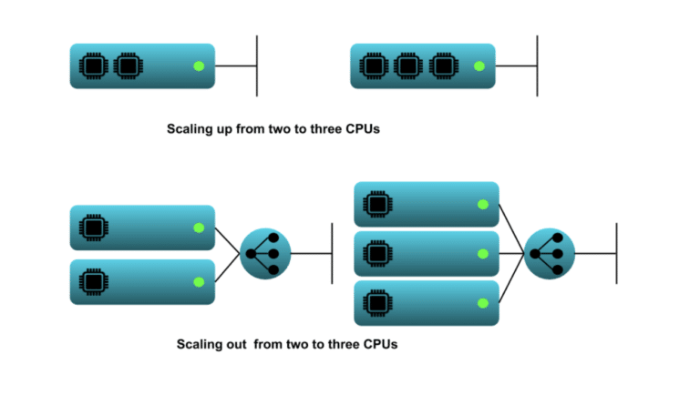
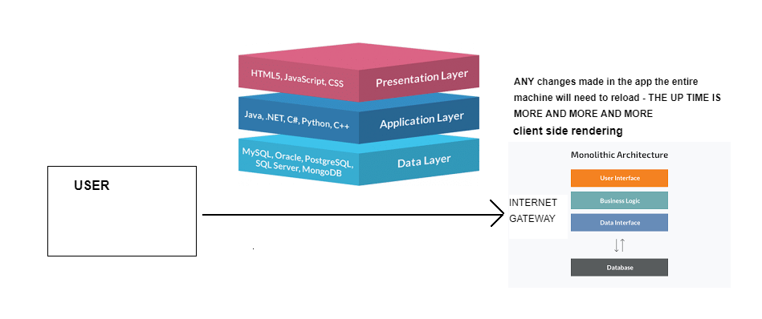
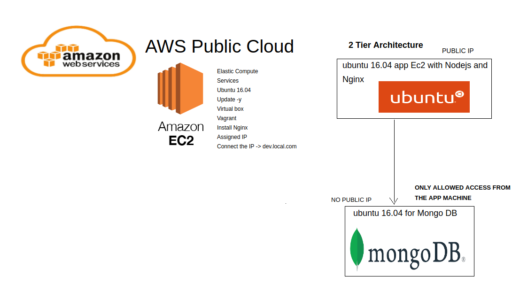
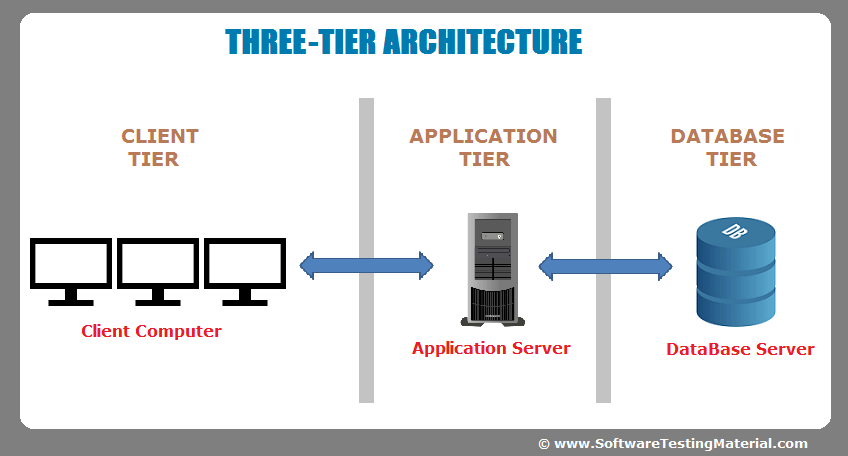
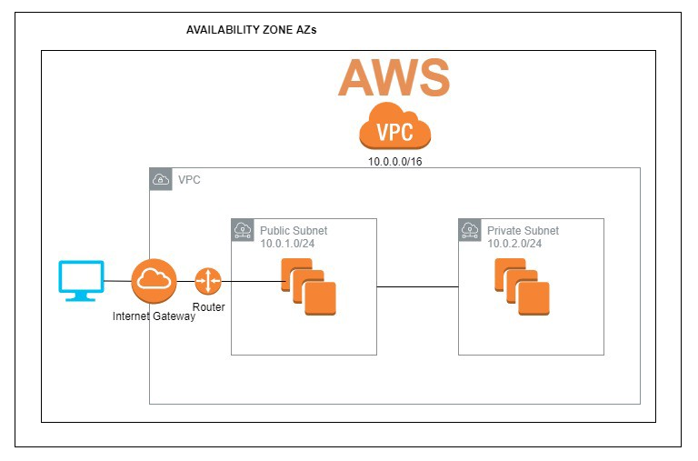
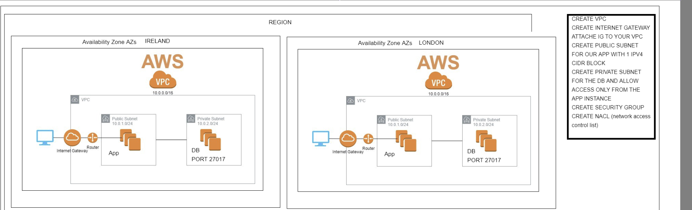

# Cloud Computing - AWS

### What is Cloud Computing

Cloud computing is a term used to describe the use of hardware and software delivered via network (usually the Internet). So is a paradigm that allows computing services to be offered through a network, which is usually the internet. Simply put, cloud computing is the delivery of computing services – including servers, storage, databases, networking, software, analytics and intelligence – over the Internet (“the cloud”) supported by four amazing pillars ease of use, flexibility, robustness, cost (AWS, scaling on demand.).

- __Benefits:__

It offers faster innovation, flexbile resources and economies of scale. Typically, you only pay for cloud services you use, helping you lower your operating costs(you don't have to spend huge amounts of money on purchasing and maintaing equipment.), run your infrastructure more efficientely and scale as your business need change (If your business demands increase, you can easily increase your cloud capacity without having to invest in physical infrastructure (Scalability).). Also cloud offers many advanced security features that guarantee that data is securely stored and handled.

1. Cost: Cloud computing eliminates the capital expense of buying hardware and software and setting up and running on-site data centres.
2. Reliability: Cloud computing makes data backup, disaster recovery and business continuity easier and less expensive because data can be mirrored at multiple redundant sites on the cloud provider’s network.
3. Security: Many cloud providers offer a broad set of policies, technologies and controls that strengthen your security posture overall, helping to protect your data, apps and infrastructure from potential threats.

- __Best use cases(Type of cloud services)/who is using it in the industry:__ 

1. Software as a Service (SaaS):

For the reason that companies grow and gather more data, they want to organize and maintain the data. So, SaaS solutions are centrally hosted in the cloud and can be accessed from anywhere, any time. It helps lines of business to more efficiently do their jobs.

2. Infrastructure as a Servive (IaaS):

There is a lot that goes into building and maintaining infrastructure. There's the hardware costs, the cost of the space, the electricity to power it, and the overhead to build and maintain it. Building out a data center can easily cost a company millions of dollars. So this allows companies to avoid costly infrastructure investments and easily access their data via the cloud, from a cloud provider on a pay-as-you-go basis.

3. Test and Development:

The flexibility of the cloud allows for environments to be built up, tested and torn down quickly. There is no need to wait months for the provisioning of a new environment.

4. Platform as a service (PaaS):

Platform as a service refers to cloud computing services that supply an on-demand environment for developing, testing, delivering and managing software applications. PaaS is designed to make it easier for developers to quickly create web or mobile apps, without worrying about setting up or managing the underlying infrastructure of servers.

5. Store, back up and recover data:

Protect your data more cost-efficiently – and at massive scale – by transferring your data over the Internet to an offsite cloud storage system that’s accessible from any location and any device.

Organizations of every type, size, and industry are using the cloud for a wide variety of use cases, such as data backup, disaster recovery, email, virtual desktops, software development and testing, big data analytics, and customer-facing web applications. For example AWS, Microsoft Azure, Google Cloud Platform.

### What is AWS

Amazon Web Services (AWS) is an extension of amazon providing on-demand cloud computing platforms and APIs to individuals, companies, and governments on a metered pay-as-you-go basis, supported by four amazing pillars ease of use, flexibility, robustness, cost.

- __3 advantages of AWS/who is using AWS in the industry:__

1. Easy to use: quickly and securely to host your applications.

2. Flexible: With AWS, you receive a virtual environment that lets you load the software and services your application requires. AWS enables you to select the operating system, programming language, web application platform, database, and other services you need

3. Cost-Effective: You pay only for the compute power, storage, and other resources you use, with no long-term contracts or up-front commitments.

__Industry who are using it:__

- Netflix
- Twitch
- LinkedIn
- Facebook
- BBC
- etc

### Types of Cloud Computing

There are three different ways to deploy cloud services: on a public cloud, private cloud or hybrid cloud.

- __Public Cloud:__

Public clouds are owned and operated by third-party cloud service providers, who deliver their computing resources such as servers and storage over the Internet. Some public cloud examples include those offered by Amazon, Microsoft, or Google. With a public cloud, all hardware, software and other supporting infrastructure are owned and managed by the cloud provider. You access these services and manage your account using a web browser.

- __Private Cloud/On premises:__

A private cloud refers to cloud computing resources used exclusively by a single business or organisation. A private cloud can be physically located on the company’s on-site data centre. Some companies also pay third-party service providers to host their private cloud. A private cloud is one in which the services and infrastructure are maintained on a private network. Is more used for banks, goverments

- __Hybrid Cloud:__

Hybrid clouds combine public and private clouds, bound together by technology that allows data and applications to be shared between them. By allowing data and applications to move between private and public clouds, a hybrid cloud gives your business greater flexibility, more deployment options and helps optimise your existing infrastructure, security and compliance. Sensitive data is saved in private cloud and publicly available information goes on the public cloud, so Hybrid Cloud shared security responsibility.

### Cloud Scaling and types

- __Scale Out/Vertical__:

Scaling out a microservices application can be as simple as spinning up a new container running a webserver app and adding it to the load balancer pool. When scaling out the idea is that it is possible to add identical services to a system to increase performance. 

Scaling out is adding more equivalently functional components in parallel to spread out a load. This would be going from two load-balanced web server instances to three instances. Scaling up, in contrast, is making a component larger or faster to handle a greater load. (For example, add new server)

- __Scale Up/Horizontal__:

The target is to increase the resources supporting your application to reach or maintain adequate performance. In a hardware-centric world, this might mean adding a larger hard drive to a computer for increased storage capacity.

The goal is to increase the resources supporting your application to reach or maintain adequate performance (For example, make a bigger server)

### Architectures

- __Monolithic:__

The difference is that when we configure our virtualization environment with vagrant, we use the monolith architecture, it means, everything in the same place, with no backup. All the code and the different parts of it are built together. The Monolithic application describes a single-tiered software application in which different components combined into a single program from a single platform. 

A single-tier application has all the layers, such as presentation, application and database in the same 'package'. This means that the application and database are on the same host. Single-tier applications are vulnerable and non-flexible. Everything is in the same "box". Any changes made in the app means the entire machine has to restart. So complex replication (Stateful)

- __Two-Tier:__

A two-tier architecture is a software architecture in which a presentation layer or interface runs on a client, and a data layer or data structure gets stored on a server. Separating these two components into different locations represents a two-tier architecture, as opposed to a single-tier architecture. Two tier architecture provides added security to the DBMS(A database management system) as it is not exposed to the end-user directly. It also provides direct and faster communication.

Wherewith our scenario is the following:

- 2 different machines on the same cloud, eg:
- Ubuntu 16.04 app EC2 with Nodejs and Nginx - Public IP
- Ubuntu 16.04 for Mongo DB - No public IP, only accessible from the app machine.
- Can restart the app without restarting the database

When the presentation layer (interface) runs on a client and a data layer/structure (database) gets stored on a server. Basically, when each instance is run on a separate machine. It separates these two components into different locations. Having separate layers can improve performance and scalability. Easy to maintain.

- __Three-Tier:__

- It is used in web based applications.
- Presentation layer, application layer, and data layer.
- It offers higher level of security. Improves data integrity.

- __Microservices:__

Arranged an application as a collection of loosely coupled services. Fine-grained and lightweight protocols.

### AWS

- __App server set up:__

1. Spinning up an EC2 instance (we use the Ireland DZ) - make sure it's Ubuntu 16.04.
2. Choose free tier for t2.micro when selecting instance type
3. Naming conventions for AWS Servers (Sparta Global only): `Eng84_jose_app`
4. Security group acts as a firewall that controls the traffic for your instance (server) on the machine. Security group works on the instance level as a firewall for your machine. Setting up strict firewalls with minimal port access. So create a security group named `eng84_jose_app_sg` with the following details: SSH, TCP, 22, IP. SSH works on Port 22.
5. DO NOT push any keys or relevant information to Git-hub.

Inside the machine run:
- `sudo apt-get update -y` and `sudo apt-get upgrade -y`
- `sudo apt-get install nginx` to install Nginx
- `sudo systemctl status nginx` to check if it was installed

6. Add http port 80 in your instance inside the security group.
7. Let's check in the browser with the public IP if nginx service is working.
8. To run the app we need to copy the app from our local machine to the server: `scp -i [pem file] [file/folder] ubuntu@[ip]:[path]`
9. Install all the dependencies, run the app and check if it is listening in the browser.

deploy instance = vagrant up

- __EC2:__

Elastic Compute Cloud (EC2) provides scalable computing capacity in the Amazon Web Services (AWS) Cloud. Using Amazon EC2 eliminates your need to invest in hardware up front, so you can develop and deploy applications faster. You can use Amazon EC2 to launch as many or as few virtual servers as you need, configure security and networking, and manage storage. Amazon EC2 enables you to scale up or down to handle changes in requirements or spikes in popularity, reducing your need to forecast traffic.

EC2 provides the following features:

1. Infrastructure running in the cloud.
2. Very flexible and scalable.
3. Virtual computing environments, known as instances.
4. Secure login information for your instances using key pairs (AWS stores the public key, and you store the private key in a secure place)
5. A firewall that enables you to specify the protocols, ports, and source IP ranges that can reach your instances using security groups.
6. Various configurations of CPU, memory, storage, and networking capacity for your instances, known as instance types.
7. Static IPv4 addresses for dynamic cloud computing, known as Elastic IP addresses.
8. Virtual networks you can create that are logically isolated from the rest of the AWS Cloud, and that you can optionally connect to your own network, known as virtual private clouds (VPCs).
9. Preconfigured templates for your instances, known as Amazon Machine Images (AMIs), that package the bits you need for your server (including the operating system and additional software)

- __VPC:__

Virtual Private Cloud (VPC) is a service that lets you launch AWS resources in a logically isolated virtual network that you define. You have complete control over your virtual networking environment, including selection of your own IP address range, creation of subnets, and configuration of route tables and network gateways. You can use both IPv4 and IPv6 for most resources in your virtual private cloud, helping to ensure secure and easy access to resources and applications.

VPC makes it easy to customize your VPC's network configuration. You can create a public-facing subnet for your web servers that have access to the internet. It also lets you place your backend systems, such as databases or application servers, in a private-facing subnet with no internet access. Amazon VPC lets you to use multiple layers of security, including security groups and network access control lists.

Benefits:

- Secure and monitored network connections.
- Simple set-up and use.
- Customizable virtual network.

Use cases:

- Host a simple, public-facing website: VPC with a Single Public Subnet Only.

- __Security Group:__

A firewall that enables you to specify the protocols, ports, and source IP ranges that can reach your instances using security groups.

A security group acts as a virtual firewall for your EC2 instances to control incoming and outgoing traffic. Inbound rules control the incoming traffic to your instance, and outbound rules control the outgoing traffic from your instance. When you launch an instance, you can specify one or more security groups. You can add rules to each security group that allow traffic to or from its associated instances. You can modify the rules for a security group at any time.

When EC2 decides whether to allow traffic to reach an instance, it evaluates all of the rules from all of the security groups that are associated with the instance.

When you launch an instance in a VPC, you must specify a security group that's created for that VPC.

Wherewith it is our responsibility to control who has access to our instances!!!

- __AMI:__

An Amazon Machine Image (AMI) provides the information required to launch an instance. You must specify an AMI when you launch an instance. You can launch multiple instances from a single AMI when you need multiple instances with the same configuration. You can use different AMIs to launch instances when you need instances with different configurations.

After you create and register an AMI, you can use it to launch new instances.

Basically, is like create a snapshot of a VM instance, with all the configuration that we have installed it that so far, for use later or recover an instance if it has been deleted.

- __Route tables/IP Table:__

A route table contains a set of rules, called routes, that are used to determine where network traffic from your subnet or gateway is directed.

Your VPC has an implicit router, and you use route tables to control where network traffic is directed. Each subnet in your VPC must be associated with a route table, which controls the routing for the subnet (subnet route table). You can explicitly associate a subnet with a particular route table. Otherwise, the subnet is implicitly associated with the main route table. A subnet can only be associated with one route table at a time, but you can associate multiple subnets with the same subnet route table.

Each route in a table specifies a destination and a target. For example, the destination for the route is 0.0.0.0/0, which represents all IPv4 addresses. The target is the internet gateway that's attached to your VPC.

We define which are the gateways to our cloud.

- __Subnets:__

A subnet is a network inside a network. They make networks more efficient as network traffic can travel a shorter distance without passing through unnecessary routers to reach its destination. Is a logical subdivision of an IP network. The practice of dividing a network into two or more networks is called subnetting. Computers that belong to the same subnet are addressed with an identical most-significant bit-group in their IP. Perfect for security. For example, a subnet for teachers and another one for students.

- Public subnets have their traffic routed to an internet gateway.
- Private subnets are not routed to an internet gateway, but its traffic is routed to a virtual private gateway for a Site-to-Site VPN connection (known as VPN-only subnet).

- __Internet Gateway:__

An internet gateway is a horizontally scaled and highly available VPC component that allows communication between your VPC and the internet. Provide a target in VPC route tables for internet-routable traffic and perform network address translation (NAT) for instances that have a public IPv4 address.

- __Regions, Edge Locations and Availability Zones:__

https://aws.amazon.com/about-aws/global-infrastructure/regions_az/

- Region:
A Regions are the physical locations where clusters of AWS data centers exist. By choosing a region for our application, we can choose to have our application be geographically close to our users, so that the connection latency can be reduced.

- Availability Zone:
Availability Zones correspond to discrete data centers with redundant power, networking and connectivity in an AWS Region. We can choose to host our application in one or more Availability Zones in order to have our application work in case there is an outage in a specific datacenter.

- Edge Location:
Edge Locations refer to locations from where the global CloudFront network can provide its service. The CloudFront service is a Content Delivery Network (CDN) that focuses on 'caching' responses from our website so that repeated requests are not handled by our servers. Along with other security features, like DDOS attack protection, the CDN provided by AWS is a useful feature to increase our application availability.

How to make your app High availablity?

Customers who care about the availability and performance of their applications want to deploy these applications across multiple AZs in the same region.

The AWS control plane (including APIs) and AWS Management Console are distributed across AWS Regions and utilize a multi-AZ architecture within each region to deliver resilience and ensure continuous availability. This ensures that customers avoid having a critical service dependency on a single data center. AWS can conduct maintenance activities without making any critical service temporarily unavailable to any customer. IF FOR ANY REASON YOUR SERVICE STOPS WORKING IN ONE AREA, YOU WILL BE ABLE TO USE ANOTHER QUICKLY BECAUSE THEY ARE CONNECTED TO EACH OTHER.  AZs are connected to each other with fast, private fiber-optic networking, enabling you to easily architect applications that automatically fail-over between AZs without interruption. All the traffic will be automatically redirect to the server that is up.

- Add multiple regions and providers in case of failure it redirect the trafic.
- Highly available systems are reliable in the sense that they continue operating even when critical components fail. They are also resilient, meaning that they are able to simply handle failure without service disruption or data loss, and seamlessly recover from such failure.

- Multi-cloud Arcitecture:

Deploying the same app using different clouds (using two or more cloud service providers). This is to increase availability. If one goes down then we still have the other.

- __NACL:__

Stands Network Access Control List. Extra level of security. Is an additional layer of security for your VPC that acts as a firewall for controlling traffic in and out of one or more subnets. It controls inbound and outbound traffic for subnets. They are an added layer of security, on top of Security Groups. As they are applied for an entire subnet, they can be used to set inbound or outbound rules for every instance included in the subnet. Acts as a firewall for controlling traffic in and out of one or more subnets. 

It operates at a subnet level - the rules apply to all the instances in the subnet (in addition to the SG rules applied to those instances).

Components:

- Type: Tells us about the type of traffic. SSH, HTTP, HTTPS
- Protocol: The set of rules that are applied to every request
- Portrange: The listening port
- Inbound rules: Aka source. These rules talk about the source from where the request or traffic is coming from. Also about the destination port/ the port through which the response is sent
- Outbound rule: Aka destination. These rules talk about where ther response should be sent. Also about the destination port
- Allow/Deny: Whether the specific traffic has to be allowed or denied

- __Stateful vs Stateless Filtering:__

Stateful filtering tracks the origin of a request and can automatically allow the reply to the request to be returned to the originating computer. For example, a stateful filter that allows inbound traffic to tcp port 80 on a webserver will allow the return traffic, usually on a high numbered port (e.g. destination tcp port 63,912) to pass through the stateful filter between the client and the webserver. The filtering device maintains a state table that tracks the origin and destination port numbers and IP addresses. Only one rule is required on the filtering device: allow traffic inbound to the web server on tcp port 80).

Security groups are stateful. This means that if they allow a request to come in they will always lets the response back out. Even if the outbound rules don't allow it. The outbound rules only apply to request made FROM your machine.

NACLs are stateless. You have to have rules to allow the request to come in and to allow the response to go back out.

Summary: Stateful filtering allows responses to go back out even if the outbound rules don't allow it. Stateless filtering will not allow for the responce to go through in the same scenario. Security groups are an example of a stateful filtering method, while NACLs are stateless.

### AWS TASK - GUIDE

<u>__STEP 1: Create the VPC__</u>

- Click `Your VPCs`. Then `Create VPC`
- Change the VPC nametag: `eng84_jose_vpc`
- Configure IPv4 CIDR block to `0.0.0.0/16` where the first 2 numbers are unique. For example, `24.24.0.0/16`
- Finally, `Create VPC`

<u>__STEP 2: Create the Internet Gateway__</u>

- Click `Internet Gateways`. Then `Create internet gateway`
- Change the nametag: `eng84_jose_ig`
- Click `Create Internet Gatway`.
- Select the Internet Gateway you have created right now. Click `Actions`. Then `Attach to VPC`. Select the VPC you have created and attach the internet gateway.

<u>__STEP 3: Create the subnets: Public and Private__</u>

- First navigate to the subnet page and click the `create subnet` button.
- Select your VPC.
- Add the Subnet name as `eng84_jose_public_subnet`
- Availability zone to `1c`.
- IPv4 CIDR block to `24.24.1.0/24` as per the VPC IP. This is the IPV4 CIDR for this current subnet, the first two numbers of this must be the same as in VPC IPV4. The third number must be unique, it can't be the same as another subnet you have created. The fourth
number must be 0. Finally we must follow that with /24.
- Then click `Create Subnet`.
- Repeat the above steps for the Private Subnet, but with the applicable name and the third number of the IPv4 CIDR block must be unique `24.24.2.0/24`.

<u>__STEP 4: Managing the route tables__</u>

- The first thing we have to do is go to the route table page and identify the one that is attached to our vpc. 
- Rename it to `eng84_jose_public_rt`
- Next you're going to want to give this subnet internet access by going to routes..
- Click `Edit routes` and do the following:

Set the destination to `0.0.0.0/0`.
Set the target to `Internet Gateway`, then select your internet gateway.
Save the configurations.

- Now we will go back to the page we were on before and associate our public subnet with this route table, start by
clicking on subnet associations and click on edit subnet associations. Select the public subnet you have created and click `save`.
- Now we want to create a new route table for the private subnet (db) with no access to the internet. We will start by clicking
create route table.
- Set the Name tag: `eng84_jose_private_rt`.
- Select your VPC and then click `Create`. NOTE: This route table is not connected to the internet.
- We will now associate our private subnet in the same way as we did before.
- With the new route table selected, select the Subnet Associations tab.
- Click `Edit subnet associations` and select the private subnet you have created and finally save.
- Your route tables are now setup.

<u>__STEP 5: Creating the EC2 instances: App and DB__</u>

<u>__STEP 6: Connecting to the instances__</u>

<u>__STEP 7: Updating the database__</u>

<u>__STEP 8: Adding a NACL to the VPC__</u>
